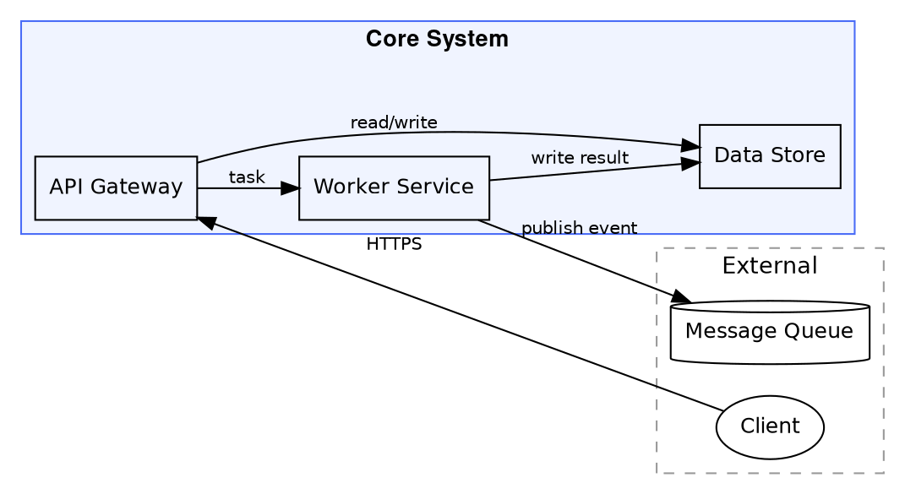
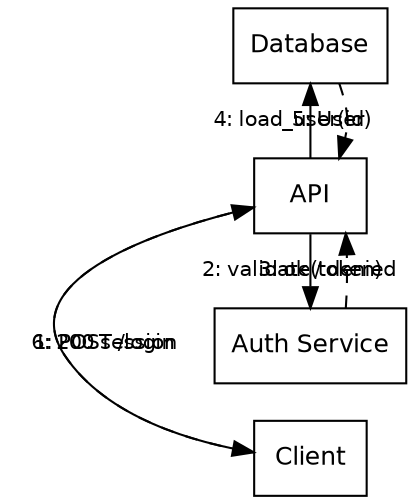
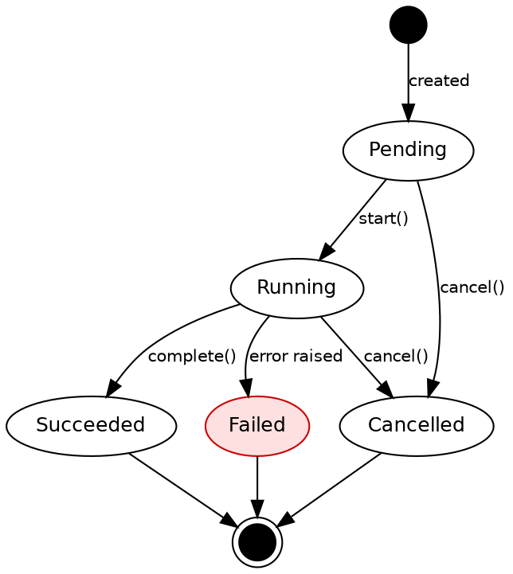
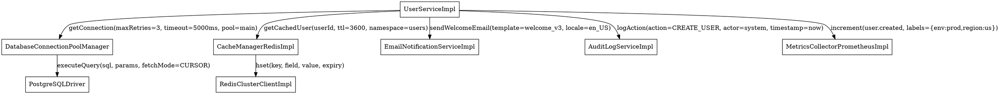
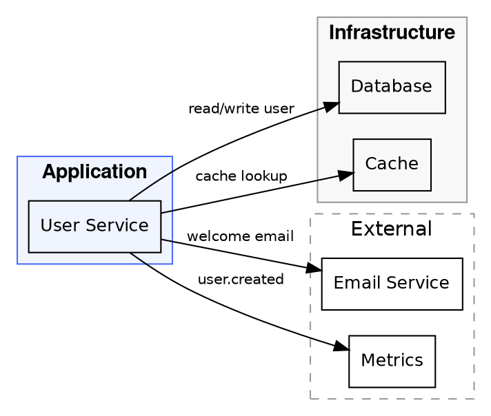

# Diagram Conventions

Conventions for producing clear, communicative diagrams using Graphviz dot syntax. A diagram that requires a legend to decode has already failed. These conventions encode what experienced engineers do naturally — and what gets lost when diagrams are generated without discipline.

---

## 1. General Principles

1. **One diagram, one idea.** Each diagram should communicate a single concept: data flow, component boundaries, state transitions, or call sequence. A diagram that tries to show everything shows nothing.

2. **Show boundaries explicitly.** Use clusters and subgraphs to group related nodes. Readers should immediately see where one subsystem ends and another begins without reading every label.

3. **Label every edge.** Unlabeled edges force readers to infer meaning. Label with what flows across the edge (data type, event name, method call, protocol), not generic terms like "calls" or "sends".

4. **Omit implementation details.** Diagrams are for communication, not for documentation of every internal. Leave out private methods, internal data structures, configuration fields, and anything that would change without affecting the architecture.

5. **Use a consistent visual language.** Pick a node shape convention (boxes for services, ellipses for actors, diamonds for decisions) and apply it throughout. Mixing styles in the same diagram is noise.

---

## 2. Architecture Diagrams

Architecture diagrams show system components, their groupings, and the relationships between them.

### Template



### Conventions

- **Clusters for subsystems.** Use `subgraph cluster_*` to group nodes that belong to the same service, domain, or deployment boundary. Fill internal clusters; use dashed borders for external systems.
- **Meaningful labels.** Node labels are roles, not implementation names. Write `"API Gateway"` not `"api_gateway_v2_handler"`.
- **Minimal styling.** Two colors maximum: one for internal, one for external. Reserve red for error paths only.
- **Edge labels describe what flows.** Label edges with the data or event name: `"HTTPS"`, `"task event"`, `"SQL query"`. Never leave edges unlabeled.
- **Left-to-right layout by default.** Use `rankdir=LR` for data flow diagrams. Use `rankdir=TB` for hierarchical decomposition.

### What to Include

- Named services, components, and external systems
- Data flows with protocol or format labels
- Deployment or trust boundaries (shown as clusters)
- Actors (users, external services) that initiate or consume flows

### What to Omit

- Internal class or function names
- Database schema details
- Configuration values and environment variables
- Anything that changes per environment (URLs, ports, credentials)

---

## 3. Sequence Diagrams

Sequence diagrams show message ordering between participants over time. Graphviz does not have native sequence support — use a directed graph with ranked nodes and numbered edge labels to imply sequence.

### Template



### Conventions

- **Number every edge.** Prefix edge labels with the step number: `"1: POST /login"`. This makes sequence unambiguous even when layout shifts.
- **Solid for requests, dashed for responses.** Use `style=solid` for outgoing requests and `style=dashed` for responses and callbacks. This maps to UML convention and aids quick reading.
- **Show the happy path only.** A sequence diagram for the success case is the primary artifact. Error branches go in a separate diagram or in a note, not interleaved.
- **Limit participants to six or fewer.** More than six participants produces crossing edges that defeat the purpose. Split into multiple diagrams if needed.

---

## 4. State Diagrams

State diagrams show the lifecycle of an entity — what states it can be in, what triggers transitions, and what terminal states exist.

### Template



### Conventions

- **Mark error states with red fill.** Use `fillcolor="#ffe0e0" color="#cc0000"` for any state that represents failure. This is the one permitted use of red in diagrams.
- **Label every transition with the trigger.** Transitions should be labeled with the event or method call that causes them: `"cancel()"`, `"timeout"`, `"error raised"`. Avoid vague labels like `"fail"` or `"done"`.
- **Use standard shapes.** States are ellipses. Start is a filled circle (`shape=circle style=filled`). End is a double circle (`shape=doublecircle`). Terminal states connect to the end marker.
- **Keep state count manageable.** Diagrams with more than ten states are hard to read. If an entity has complex sub-states, split by lifecycle phase into separate diagrams.

---

## 5. Common Pitfalls

### Bad: Cluttered diagram



**Problems:** Implementation class names instead of roles. Edge labels expose internal parameters. No subsystem grouping. More than six nodes with no clusters means readers must trace individual lines to understand structure.

### Good: Clean diagram



**Why it works:** Role-based node names. Short, descriptive edge labels. Clusters make subsystem boundaries visible at a glance. Layout communicates that the app layer uses both infrastructure and external services.

---

## 6. Rendering

Convert dot files to image formats using the Graphviz CLI:

```bash
# Render to PNG (default for documentation)
dot -Tpng diagram.dot -o diagram.png

# Render to SVG (preferred for web — scales cleanly)
dot -Tsvg diagram.dot -o diagram.svg

# Render to PDF (for print or presentation)
dot -Tpdf diagram.dot -o diagram.pdf

# Render with increased DPI for high-resolution output
dot -Tpng -Gdpi=150 diagram.dot -o diagram.png

# Preview using xdg-open (Linux) or open (macOS)
dot -Tsvg diagram.dot -o /tmp/preview.svg && open /tmp/preview.svg
```

**Tip:** Always render to SVG when embedding in web documentation. SVG scales without pixelation and supports text selection. Use PNG when SVG is not supported by the target system.
